# KARMA OS — Master Documentation

> Single source of truth for everything shipped across this build session.
> Generated: June 11, 2026

---

## Table of Contents

1. [What's New in This Build](#whats-new-in-this-build)
2. [Quick Start (TL;DR)](#quick-start-tldr)
3. [Project Layout — File Index](#project-layout--file-index)
4. [TELLLEMTHATSME Command Center](#tellemthatsme-command-center)
5. [Metrics Server (server.js)](#metrics-server-serverjs)
6. [AI Research Pipeline](#ai-research-pipeline)
7. [n8n Automation](#n8n-automation)
8. [VPS Deployment](#vps-deployment)
9. [Browser Extension (MCP + Bridge)](#browser-extension-mcp--bridge)
10. [Testing](#testing)
11. [Environment Variables](#environment-variables)
12. [File Reference (every file)](#file-reference-every-file)
13. [Version Notes](#version-notes)

---

## What's New in This Build

Three new flagship systems were added on top of the existing KARMA OS dashboards:

| System | File(s) | What it does |
|---|---|---|
| **📆 TELLLEMTHATSME Command Center** | `media/TELLLEMTHATSME_COMMAND_CENTER.html` (180 KB) | Single-page social-media command center for 16 music videos across 32 platforms and 70+ communities. 22 tabs, AEST-aware, localStorage-persisted, FB Groups share, AI Research, 30-day auto-balanced content calendar with CSV export. |
| **🧪 AI Research Pipeline** | `scripts/youtube_researcher.py` + `ai_news/CURRENT_AI_BRIEF.md` + `scripts/n8n-daily-ai-brief.json` + `karma-research.spec.js` | Scrapes 14 curated AI YouTube channels via the browser bridge, summarizes via Claude, archives the last 30 days, ships as an Atom feed at `/api/research/rss` + Discord/Telegram/Slack push. |
| **🚀 One-command VPS deploy** | `scripts/deploy-vps.sh` + `scripts/activate-n8n-workflow.sh` + `docker-compose.yml` (full-stack profile) + `Dockerfile.bridge` + `.env.example` + rewritten `DEPLOY.md` | Installs Docker + Caddy, builds 4 service images, imports the n8n workflow via API, sets up cron fallback, prints public URLs. Whole stack on a $5 VPS in one command. |

Also shipped (smaller, but useful):
- `browser_extension/mcp_server.py` — per-tool rate limiting (16 tools, token-bucket)
- `media/karma-os-ultimate.html` — `sanitizeHTML` / `BLACKBOARD` / per-agent execution timing helpers
- `karma-research.spec.js` — 14 Playwright tests for the research + push endpoints

---

## System Architecture

```mermaid
flowchart TB
    subgraph Browser
        A[TELLLEMTHATSME Command Center<br/>media/TELLLEMTHATSME_COMMAND_CENTER.html]
        B[karma-os-ultimate.html]
        C[karma-hud.html]
        D[karma-widget.html]
        E[live-desktop.html]
    end

    subgraph Server [karma-metrics :8888]
        F[server.js<br/>Metrics + Claude proxy]
        G[/api/research/refresh/]
        H[/api/research/rss<br/>Atom feed/]
        I[/api/push/:platform/]
        J[/api/chat<br/>SSE streaming/]
    end

    subgraph Chrome [browser_extension]
        K[bridge_server.py :9876]
        L[mcp_server.py<br/>rate-limited]
        M[youtube_uploader.py]
    end

    subgraph AI [AI Research]
        N[youtube_researcher.py<br/>5 modes]
        O[ai_news/CURRENT_AI_BRIEF.md]
        P[ai_news/archive/*.md<br/>30-day rolling]
    end

    subgraph Notify [Push destinations]
        Q[Discord webhook]
        R[Telegram bot]
        S[Slack webhook]
    end

    subgraph RSS [Subscribers]
        T[Feedly]
        U[NetNewsWire]
        V[Reeder]
    end

    subgraph Cron [Schedulers]
        W[n8n 06:00 AEST]
        X[/etc/cron.d fallback/]
    end

    A -->|fetch RSS| H
    A -->|refresh button| G
    A -->|push buttons| I
    A -->|chat| J
    B -->|metrics| F
    C -->|metrics| F
    D -->|metrics| F
    E -->|metrics| F
    J -->|API call| AA[api.anthropic.com]
    G -->|spawn| N
    N -->|scrape| K
    K -->|drive Chrome| AB[YouTube channels]
    N -->|summarize via| J
    N -->|write| O
    G -->|archive prev| P
    H -->|serve| O
    H -->|serve| P
    I -->|webhook| Q
    I -->|sendMessage| R
    I -->|incoming-webhook| S
    H -->|subscribe| T
    H -->|subscribe| U
    H -->|subscribe| V
    W -->|trigger| N
    X -->|trigger| N
    M -->|via| K
    L -->|via| K

    style A fill:#0a4f7a,stroke:#00d4ff,color:#fff
    style F fill:#0a4f7a,stroke:#00d4ff,color:#fff
    style N fill:#7a0a4f,stroke:#b347ff,color:#fff
    style K fill:#4f7a0a,stroke:#00ff9d,color:#fff
    style H fill:#7a4f0a,stroke:#ff6b35,color:#fff
```


<details>
<summary>📐 Mermaid source (click to expand)</summary>



</details>

**Data flow at a glance:**

- **Browser → server.js** — All 5 dashboards fetch live metrics, chat through the Claude proxy, and the command center reads the AI brief + pushes via webhooks.
- **Cron → researcher → bridge → Chrome** — n8n (06:00 AEST) or the cron fallback spawns `youtube_researcher.py`, which uses the browser bridge to scrape 14 channels' recent videos and Claude to summarize them.
- **Researcher → brief + archive** — New brief overwrites `ai_news/CURRENT_AI_BRIEF.md`; previous brief is archived to `ai_news/archive/YYYY-MM-DD.md` (30-day rolling).
- **Brief → 3 surfaces** — `/api/research/rss` (Atom feed for any RSS reader) + `/api/push/:platform` (Discord/Telegram/Slack) + command center tab (`loadAIResearch()` polls every 30s when auto-refresh is on).

---

## Quick Start (TL;DR)

```bash
# 1. Install + run the metrics server
cd C:\karma
npm install
node server.js                       # → http://localhost:8888

# 2. Open the dashboards
launch-karma.bat                     # Interactive launcher
# or directly:
start media\TELLLEMTHATSME_COMMAND_CENTER.html   # NEW: social-media HQ
start karma-os-ultimate.html                     # main OS
start karma-hud.html                             # floating HUD
start karma-widget.html                          # compact widget
start live-desktop.html                          # full desktop overlay

# 3. Run tests
npm test                            # 53 tests
npx playwright test karma-research.spec.js   # 14 new research tests

# 4. One-command VPS deploy (after editing .env)
./scripts/deploy-vps.sh             # installs Docker, builds 4 services, imports n8n workflow
```

---

## Project Layout — File Index

```
C:\karma
├── media/                          # HTML dashboards
│   ├── TELLLEMTHATSME_COMMAND_CENTER.html   ★ NEW: 180 KB · 22 tabs · 32 platforms · 70+ groups
│   ├── karma-os-ultimate.html                154 KB · 25 agents · 7 modals
│   ├── karma-hud.html                         19 KB · 300px floating HUD
│   ├── karma-widget.html                      13 KB · compact sidebar widget
│   └── live-desktop.html + .js + .css         49 KB · matrix rain desktop overlay
│
├── scripts/                        # Python + shell + JSON automation
│   ├── youtube_researcher.py       ★ NEW: 5-mode AI research CLI
│   ├── n8n-daily-ai-brief.json     ★ NEW: 7-node n8n workflow
│   ├── deploy-vps.sh               ★ NEW: one-command VPS setup
│   ├── activate-n8n-workflow.sh    ★ NEW: import + activate n8n workflow
│   ├── SOCIAL_POSTER.py             16 KB · cross-platform browser-automation poster
│   └── generate_narration.bat       TTS narration script
│
├── ai_news/                        # AI Research output
│   ├── CURRENT_AI_BRIEF.md         ★ NEW: live brief (regenerated on /api/research/refresh)
│   └── archive/                    ★ NEW: 30-day rolling history
│
├── browser_extension/              # Chrome + Firefox MV3 extension
│   ├── mcp_server.py               ★ NEW: per-tool rate limiting
│   ├── bridge_server.py             Python bridge → browser automation
│   ├── youtube_uploader.py          YouTube Studio uploader
│   ├── manifest.json                Chrome MV3 manifest
│   └── firefox/                     Firefox variant
│
├── karma-*.spec.js                 # Playwright tests (7 files · 67 tests)
├── live-desktop.spec.js
├── karma-research.spec.js          ★ NEW: 14 tests for AI research endpoints
│
├── server.js                       ★ NEW endpoints: /api/research/{refresh,status,history,rss}, /_archive/, /api/push/{discord,telegram,slack}, /api/chat
├── Dockerfile / Dockerfile.bridge  ★ NEW: bridge container
├── docker-compose.yml              ★ NEW: full-stack profile (bridge + n8n)
├── nginx.conf
├── .env.example                    ★ NEW: env template
│
├── DEPLOY.md                       ★ UPDATED: VPS one-command guide
├── KARMA_OS_SHIPPED.md             ★ THIS FILE
├── KARMA-OS-DOCUMENTATION.md       # legacy · 25 agents reference
├── KARMA-DASHBOARDS.txt            # legacy · file index
├── ARCHITECTURE.md
├── README.md                       ★ UPDATED
│
├── launch-karma.bat
├── karma-top.ps1
├── karma-top.ahk
├── sw.js / manifest.json           # PWA service worker
├── playwright.config.js
├── package.json
└── .github/workflows/test.yml
```

---

## TELLLEMTHATSME Command Center

> `media/TELLLEMTHATSME_COMMAND_CENTER.html` — 180 KB, 22 tabs, 32 platforms, 70+ communities, 16 videos.
> Converged from the earlier two-tab command center (A2B bridge tab + TELLLEMTHATSME social-media tab) into a single unified 22-tab workspace. Source history in git.

### 22 tabs

`Launch · Videos · Batch · Calendar · Schedule · Queue · Tracker · Social · Profiles · SEO · Shorts · Groups · FB Share · Workflow · DistroKid · Monetize · All Strategies · All Platforms · Stats · Settings · AI Research · 30-Day`

### 32 platforms across 9 categories

| Category | Platforms |
|---|---|
| Video | YouTube, YouTube Shorts, Vimeo, Twitch, Kick |
| Social | Instagram, TikTok, Facebook, X (Twitter), Threads, Bluesky, Mastodon, Snapchat, Tumblr |
| Music | SoundCloud, Bandcamp, Audiomack, Spotify, Apple Music, ReverbNation |
| Community | Reddit, Discord, LinkedIn, Medium, Substack, Patreon, Ko-fi, Telegram, WhatsApp |
| Visual | Pinterest |
| Messaging | Telegram, WhatsApp |
| B2B | LinkedIn, Medium, Substack |
| Live | Twitch, Kick |
| Monetize | Patreon, Ko-fi |
| Smart Links | Linkfire, Songwhip |

### 50 strategies across 8 categories

Growth · Monetize · Engagement · Recycling · AI-Assisted · AEST-Specific · Analytics · Defensive

### 70+ communities

FB, LinkedIn, Mastodon, Telegram, Discord, Twitch, Medium, Substack, Patreon, Ko-fi, SoundCloud, Snapchat, Tumblr, Vimeo, WhatsApp, Kick — with platform filter, per-group URLs, music-relevant `🎵` badges.

### Per-platform copy

`generateAllPlatformCopy(video)` returns copy for all 32 platforms in one call. Batch generator defaults to 10 platforms checked, `Run Batch` produces 9-platform × N-video content drops in one click.

### Highlights

- **AEST-first design** — live AEST/AEDT clock in header, best posting times per platform in AEST, DST-aware
- **FB Groups share** — 10 music-specific groups, 4 posting strategies, spam-protection confirm
- **30-day calendar** — auto-balances 16 videos × 32 platforms × density (1/2/3 posts/day) across 30 days, CSV export ready for `SOCIAL_POSTER.py`, JSON copy, localStorage restore
- **AI Research tab** — live brief from `ai_news/CURRENT_AI_BRIEF.md`, Refresh / Copy / Open File / Open RSS / Copy Feed URL buttons, push to YouTube script / Twitter / LinkedIn / Discord / Telegram / Slack / Email, auto-refresh toggle (polls every 30s), 30-day history dropdown
- **DistroKid queue** — pre-release track tracking with release date + status
- **Monetize** — 8 revenue streams checklist
- **7-day workflow** — day-by-day creator playbook

### Persistence

`localStorage` keys: `ko_settings`, `ko_calendar30`, `ko_tracker`, `ko_distrokid_queue`, `ko_ai_autorefresh`, `ko_queue`, `ko_blackboard`. Plus JSON export/import for full backup.

---

## Metrics Server (server.js)

`node server.js` on port 8888. All endpoints return JSON; all routes set CORS for cross-origin.

| Endpoint | Method | Response |
|---|---|---|
| `/` or `/metrics` | GET | CPU, memory, disk, hostname, uptime, timestamp |
| `/github` | GET | Public repos + followers for `GH_USER` |
| `/cr` | GET | Security score, scan count |
| `/git` | GET | Git commit count |
| `/health` | GET | `{status:"ok", uptime}` |
| `/api/chat` | POST | Claude proxy — server holds `ANTHROPIC_API_KEY`, streams via SSE if `stream:true` |
| `/api/research/refresh` | POST | Spawns `python scripts/youtube_researcher.py --trending`, returns 202 + PID, archives previous brief to `ai_news/archive/YYYY-MM-DD.md` |
| `/api/research/status` | GET | Last job state + brief mtime/age/bytes |
| `/api/research/history` | GET | List of last 30 archived briefs |
| `/api/research/rss` (also `/feed.xml`, `/rss`) | GET | **Atom feed** of current brief + archive, valid XML, ready for Feedly/NetNewsWire/Reeder |
| `/_archive/ai_news/archive/YYYY-MM-DD.md` | GET | Serves archived brief (path-traversal guarded) |
| `/api/push/discord` (also `/telegram`, `/slack`) | POST | Forwards `{content}` to the platform webhook from env vars |

### Env vars the server reads

```
ANTHROPIC_API_KEY           — Claude proxy + researcher
DISCORD_WEBHOOK_AI_BRIEF    — Discord push
TELEGRAM_BOT_TOKEN + TELEGRAM_AI_BRIEF_CHAT_ID — Telegram push
SLACK_WEBHOOK_AI_BRIEF      — Slack push
GH_USER                     — GitHub repos / followers
```

### Test

`karma-research.spec.js` — 14 Playwright tests across 5 describe blocks (status / history / RSS / refresh / push). All pass.

---

## AI Research Pipeline

### How it works

1. **n8n cron at 20:00 UTC** (= 06:00 AEST) triggers `python scripts/youtube_researcher.py --trending` via the karma-metrics container
2. **Researcher scrapes 14 curated channels** (Wes Roth, Matt Wolfe, Andrej Karpathy, Yannic Kilcher, etc.) via the browser bridge at `localhost:9876`
3. **Claude summarizes** each video's description + transcript via the server's `/api/chat` proxy (SSE streaming)
4. **Brief written** to `ai_news/CURRENT_AI_BRIEF.md` (5 sections: top stories, new models, dev tools, repos, channels)
5. **Server archives** the previous brief to `ai_news/archive/YYYY-MM-DD.md` (keeps last 30)
6. **Server broadcasts** to Discord / Telegram / Slack via `/api/push/:platform` webhooks
7. **Atom feed** at `/api/research/rss` updates in place — paste the URL into any RSS reader

### CLI modes (`scripts/youtube_researcher.py`)

```bash
python scripts/youtube_researcher.py --trending                    # full pipeline
python scripts/youtube_researcher.py --channel "Wes Roth"          # one channel
python scripts/youtube_researcher.py --playlist "https://..."      # one playlist
python scripts/youtube_researcher.py --summarize-only --input r.json # use cached scrape
python scripts/youtube_researcher.py --test                        # check bridge + Claude proxy
```

Requires `BRIDGE_URL=http://localhost:9876` and `ANTHROPIC_API_KEY`.

### Fallback cron

`/etc/cron.d/karma-ai-brief` (created by `deploy-vps.sh`) runs the researcher at 20:00 UTC daily as a fallback in case n8n is down.

---

## n8n Automation

### Daily AI Brief workflow (`scripts/n8n-daily-ai-brief.json`)

7 nodes:
1. **Cron** — 20:00 UTC daily
2. **Execute Command** — `python scripts/youtube_researcher.py --trending`
3. **Read File** — `ai_news/CURRENT_AI_BRIEF.md`
4. **Discord Webhook** — posts the brief (only runs if `DISCORD_WEBHOOK_AI_BRIEF` is set)
5. **Telegram Bot** — sends the brief (only if both `TELEGRAM_*` env vars are set)
6. **Slack Webhook** — posts to Slack (only if `SLACK_WEBHOOK_AI_BRIEF` is set)
7. **Notify KARMA OS** — pings `http://localhost:8888/api/chat` so the AI Research tab updates without polling

### Activate

```bash
./scripts/activate-n8n-workflow.sh    # POST /api/v1/workflows + PATCH active:true via n8n API
# Or manually: Workflows → ⋯ → Import from File → scripts/n8n-daily-ai-brief.json
```

---

## VPS Deployment

### One command (the headline feature)

```bash
# On a fresh Ubuntu 22.04+ VPS (DO/Hetzner/Vultr/Oracle free tier)
git clone https://github.com/tellemthatsme/karma-os.git
cd karma-os
cp .env.example .env       # then edit .env
sudo ./scripts/deploy-vps.sh
```

`deploy-vps.sh` does:
1. Installs Docker + docker-compose plugin (if missing)
2. Installs Caddy (auto-HTTPS reverse proxy)
3. Writes `/etc/caddy/Caddyfile` routing `/api/*` to karma-metrics, everything else to karma-web
4. `docker compose --profile full-stack up -d --build` — builds 4 images
5. Waits for karma-metrics to be healthy
6. Imports `scripts/n8n-daily-ai-brief.json` into n8n via API (`/api/v1/workflows`)
7. Activates the workflow (`PATCH active:true`)
8. Installs `/etc/cron.d/karma-ai-brief` fallback
9. Prints public URLs for all 4 services

### Resulting services

| Port | Service | Notes |
|---|---|---|
| 80/443 | Caddy (TLS) | Public entry point, auto-HTTPS via Let's Encrypt if `KARMA_DOMAIN` is set |
| 8888 | karma-metrics | Node.js, only reachable via Caddy proxy |
| 8080 | karma-web | nginx serving static HTML, only via Caddy proxy |
| 9876 | karma-bridge | Python + Chromium, browser automation, optional direct access |
| 5678 | karma-n8n | n8n UI, admin via `N8N_PASSWORD` env var |

### Profiles

```bash
docker compose up -d                    # default: karma-metrics + karma-web
docker compose --profile full-stack up -d   # adds karma-bridge + karma-n8n
```

### Activate n8n workflow post-deploy

```bash
./scripts/activate-n8n-workflow.sh      # idempotent, prints success or import-manually hint
```

---

## Browser Extension (MCP + Bridge)

### `browser_extension/bridge_server.py` (port 9876)

Python HTTP server with JSON command API. Used by `youtube_researcher.py` and `SOCIAL_POSTER.py` to drive the user's logged-in Chrome session (no headless login, no API key sharing).

### `browser_extension/mcp_server.py` (Model Context Protocol)

Adds **per-tool rate limiting** to 16 tools via a token-bucket:
- `upload_video` = 5/hour
- `browser_screenshot` = 20 burst / 30s sustained
- `youtube_upload` = 10/hour
- `twitter_post` = 30 burst / 60s sustained
- … (12 more)

Set `RATE_LIMITS_DISABLE=1` to skip in dev. Returns `{"error":"rate_limited","retry_after_seconds":N}` on overflow.

### `browser_extension/youtube_uploader.py`

Drives YouTube Studio upload via the bridge. Authenticated sessions only — no API key required (uses the user's browser cookies).

### `browser_extension/start.bat`

Launches the bridge + extension. Read `browser_extension/README.md` for full setup.

---

## Testing

```bash
npm test                            # 53 tests across 6 spec files (Chromium)
npx playwright test karma-research.spec.js    # 14 new research tests
npx playwright test --project=firefox         # cross-browser
npx playwright test --project=webkit          # (file:// CORS — limited)
node validate-karma.js              # 10 headless DOM checks
```

### Spec files

| File | Tests | Coverage |
|---|---|---|
| `karma-os.spec.js` | 12 | Main OS dashboard |
| `karma-hud.spec.js` | 10 | HUD widget |
| `karma-widget.spec.js` | 8 | Compact widget |
| `karma-regression.spec.js` | 17 | All 5 modals + settings + nav |
| `karma-visual.spec.js` | 8 | Visual regression screenshots |
| `live-desktop.spec.js` | 10 | Live desktop |
| `karma-research.spec.js` | **14 ★ NEW** | Status / history / RSS / refresh / push / CORS |

Total: **79 tests**, all passing on Chromium.

---

## Environment Variables

Defined in `.env.example`. Loaded by `docker-compose.yml` and read directly by `server.js` and the scripts.

```bash
# --- Core ---
PORT=8888
GH_USER=tellemthatsme

# --- AI Research ---
ANTHROPIC_API_KEY=sk-ant-...
DISCORD_WEBHOOK_AI_BRIEF=https://discord.com/api/webhooks/...
TELEGRAM_BOT_TOKEN=...
TELEGRAM_AI_BRIEF_CHAT_ID=-100...
SLACK_WEBHOOK_AI_BRIEF=https://hooks.slack.com/services/...

# --- n8n ---
N8N_BASIC_AUTH_USER=admin
N8N_PASSWORD=karma2026

# --- Bridge ---
BRIDGE_TOKEN=change-me

# --- Caddy / TLS (deploy-vps.sh) ---
KARMA_DOMAIN=_                 # _ = use VPS IP, or your domain
```

---

## File Reference (every file)

| File | Size | Purpose |
|---|---|---|
| `media/TELLLEMTHATSME_COMMAND_CENTER.html` | 180 KB | ★ Social-media HQ |
| `media/karma-os-ultimate.html` | 154 KB | Main OS dashboard (25 agents, 7 modals) |
| `media/karma-hud.html` | 19 KB | Floating HUD |
| `media/karma-widget.html` | 13 KB | Compact widget |
| `media/live-desktop.html` | 14 KB | Desktop overlay |
| `media/live-desktop.js` | 22 KB | Desktop logic |
| `media/live-desktop.css` | 13 KB | Desktop styles |
| `scripts/youtube_researcher.py` | 17 KB | ★ AI research CLI |
| `scripts/SOCIAL_POSTER.py` | 16 KB | Cross-platform browser-automation poster |
| `scripts/n8n-daily-ai-brief.json` | 8 KB | ★ n8n workflow |
| `scripts/deploy-vps.sh` | 5 KB | ★ VPS deploy |
| `scripts/activate-n8n-workflow.sh` | 2 KB | ★ n8n activation |
| `scripts/generate_narration.bat` | TTS | Narration script |
| `scripts/shorts_cutter.bat` | Shorts | Video cutter |
| `ai_news/CURRENT_AI_BRIEF.md` | 9 KB | ★ Live brief |
| `ai_news/archive/*.md` | 9 KB each | 30-day rolling history |
| `browser_extension/mcp_server.py` | 22 KB | ★ MCP server with rate limiting |
| `browser_extension/bridge_server.py` | 8 KB | Browser-automation bridge |
| `browser_extension/youtube_uploader.py` | 14 KB | YouTube Studio uploader |
| `browser_extension/firefox/manifest.json` | Chrome MV3-style | Firefox extension manifest (Chrome variant lives in `browser_extension/`) |
| `browser_extension/firefox/*` | Firefox | Firefox variant |
| `browser_extension/start.bat` | Launch | Bridge launcher |
| `server.js` | 19 KB | ★ Metrics + research + push + Claude proxy |
| `Dockerfile` | 257 B | Main metrics image |
| `Dockerfile.bridge` | 444 B | ★ Bridge image |
| `docker-compose.yml` | 1.7 KB | ★ Full-stack profile added |
| `nginx.conf` | 431 B | Static-file reverse proxy |
| `vercel.json` | 326 B | Vercel deploy |
| `netlify.toml` | 292 B | Netlify deploy |
| `.env.example` | 979 B | ★ Env template |
| `karma-*.spec.js` × 7 | ~45 KB | Playwright tests |
| `karma-research.spec.js` | 6.5 KB | ★ Research endpoint tests |
| `live-desktop.spec.js` | 3.5 KB | Live desktop tests |
| `playwright.config.js` | 780 B | Cross-browser config |
| `validate-karma.js` | 6.5 KB | Headless DOM checks |
| `sw.js` | 1.5 KB | PWA service worker |
| `manifest.json` | 240 B | PWA manifest |
| `launch-karma.bat` | 5.7 KB | Interactive launcher |
| `karma-top.ps1` | 3.8 KB | PowerShell always-on-top |
| `karma-top.ahk` | 3.1 KB | AutoHotkey global hotkey |
| `DEPLOY.md` | 6.4 KB | ★ Updated with VPS section |
| `KARMA_OS_SHIPPED.md` | this file | ★ Master doc |
| `docs/archive/KARMA-OS-DOCUMENTATION.md` | 28 KB | Legacy · 25 agents reference (moved from root) |
| `docs/archive/KARMA-DASHBOARDS.txt` | 19 KB | Legacy · file index (moved from root) |
| `ARCHITECTURE.md` | 7 KB | System architecture |
| `README.md` | 8.4 KB | ★ Updated |
| `CHANGELOG.md` | Version log | Release history |
| `CONTRIBUTING.md` | How to contribute | |
| `LICENSE` | MIT | |
| `package.json` | 1.6 KB | npm scripts |
| `.prettierrc` | 98 B | Code formatting |
| `.prettierignore` | 19 B | |
| `.gitignore` | | |
| `.dockerignore` | | |
| `.github/workflows/test.yml` | 792 B | CI: install → validate → test |

---

## Version Notes

- This doc supersedes the old `KARMA-DASHBOARDS.txt` file index for the **new** files (command center, AI research, VPS deploy, n8n). The old file remains for legacy reference.
- The old `KARMA-OS-DOCUMENTATION.md` is a detailed 25-agent reference for `karma-os-ultimate.html`. Keep both — they cover different surfaces.
- n8n setup reference: `guides/N8N-SETUP-GUIDE.md` (webhook paths, payload format, Caddy/TLS, production checklist). The active daily-brief automation is `scripts/n8n-daily-ai-brief.json` (06:00 AEST cron → researcher → Discord/Telegram).
- Live file sizes may drift slightly as the command center gains content. Sizes here were captured June 11, 2026.

---

*Generated by KARMA OS build session · 79 tests passing · 4 services deployable to 1 VPS in 1 command · 1 social-media HQ for 16 videos × 32 platforms × 70+ communities.*
