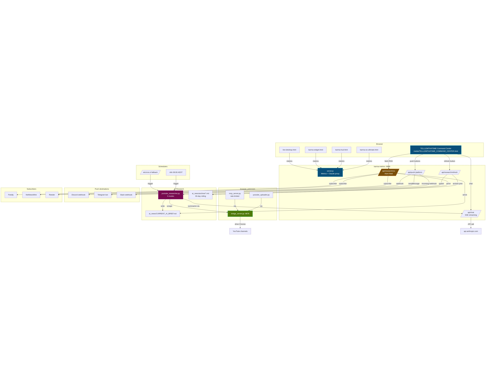

# ⚡ KARMA OS

> A cyberpunk-themed multi-dashboard system monitor with a floating HUD, widget, live desktop overlay, unified launcher, real-time metrics backend, **AI Research pipeline** (RSS/Discord/Telegram/Slack), **one-command VPS deploy**, and a **social-media command center** for 16 videos × 32 platforms × 70+ communities.

> 📖 **Start here:** [`KARMA_OS_SHIPPED.md`](KARMA_OS_SHIPPED.md) — master documentation for everything in this build.
> 📊 **For the social-media HQ:** open `media/TELLLEMTHATSME_COMMAND_CENTER.html` (22 tabs · 180 KB · 32 platforms · AEST-aware).
> 🤖 **For AI Research:** open the **🧪 AI Research** tab in the command center, or hit `http://localhost:8888/api/research/rss` for the Atom feed.


---


## Architecture



_Full data flow: 5 dashboards → server.js endpoints → browser bridge → YouTube channels → researcher → brief + archive → Atom feed / Discord / Telegram / Slack / n8n cron / VPS cron fallback._

## 🖥️ Dashboards

| Dashboard | File | Size | Description |
|---|---|---|---|
| **Unified Launcher** | `index.html` | 26 KB | Single-page hub with 6 themes, command palette, keyboard shortcuts, sound effects, data export |
| **Main OS** | `karma-os-ultimate.html` | 134 KB | Full terminal-style system monitor with agents, crypto, activity feed, and command palette |
| **HUD Widget** | `karma-hud.html` | 18 KB | 300px floating overlay — draggable, collapsible, always-on-top, NITRO boost |
| **Compact Widget** | `karma-widget.html` | 12 KB | Lightweight sidebar widget with system metrics and quick actions |
| **Live Desktop** | `live-desktop.html` + `.js` + `.css` | 47 KB | Desktop overlay with matrix rain, terminal HUD, CR analysis, and fleet management |

## 🚀 Quick Start

```bash
# Clone
git clone https://github.com/tellemthatsme/karma-os.git
cd karma-os

# Install
npm install
npx playwright install chromium

# Launch all dashboards
launch-karma.bat
```

### Launch Options (launch-karma.bat)

| Key | Action |
|---|---|
| `1` | Open Main OS Dashboard |
| `2` | Open HUD Widget (frameless, top-right) |
| `3` | Open Compact Widget |
| `4` | Open Live Desktop |
| `5` | Open HUD in always-on-top mode |
| `6` | Open All Dashboards |
| `T` | Toggle always-on-top (via PowerShell) |
| `V` | Run validation checks |
| `D` | Run all tests |
| `H` | View documentation |

### Always-On-Top

```powershell
# Toggle always-on-top for HUD window
powershell -ExecutionPolicy Bypass -File karma-top.ps1

# Toggle for widget window
powershell -ExecutionPolicy Bypass -File karma-top.ps1 -Widget

# AutoHotkey: press Ctrl+Shift+T from anywhere
karma-top.ahk
```

## 🎮 Unified Dashboard Features

The `index.html` launcher includes:

- **6 Color Themes** — Cyberpunk, Stealth, Alert, Matrix, Aurora, Light
- **Command Palette** — `Ctrl+K` to search dashboards and switch themes
- **Keyboard Shortcuts** — `Ctrl+K` (palette), `Ctrl+M` (mute), `Ctrl+E` (export), `1`-`6` (open dashboards), `T` (cycle themes), `Esc` (close)
- **Sound Effects** — Web Audio API synthesized clicks, opens, theme changes, success/error chimes
- **Toast Notifications** — Animated info/success/warning/error messages
- **Data Export** — Downloads JSON + CSV files with metrics, settings, and dashboard info
- **Live Metrics** — CPU, memory, uptime from `localhost:8888`
- **Responsive Design** — Breakpoints at 768px and 480px for mobile/tablet
- **LocalStorage Persistence** — Theme and mute settings shared across all dashboards

## 🧪 Testing

```bash
# Run all 53 tests (Chromium)
npm test

# Run specific suites
npm run test:hud          # 10 tests — HUD widget
npm run test:widget       #  8 tests — compact widget
npm run test:desktop      # 10 tests — live desktop
npm run test:regression   # 17 tests — main OS regression
npm run test:visual       #  8 tests — visual regression screenshots

# Cross-browser (requires browsers installed)
npx playwright test --project=firefox    # 50/53
npx playwright test --project=webkit     # 38/53

# Validation
npm run validate          # 10 structural checks
```

### Cross-Browser Results

| Browser | Pass | Fail | Notes |
|---|---|---|---|
| **Chromium** | 53 | 0 | Full pass — primary test target |
| **Firefox** | 50 | 3 | Minor: bar visibility, toast timing |
| **WebKit** | 38 | 15 | CORS/timeout on `file://` — works when served via HTTP |

## 📁 Project Structure

```
karma-os/
├── index.html                 # Unified dashboard launcher (26 KB)
├── karma-os-ultimate.html     # Main OS dashboard (134 KB)
├── karma-hud.html             # Floating HUD widget (18 KB)
├── karma-widget.html          # Compact sidebar widget (12 KB)
├── live-desktop.html          # Desktop overlay (12 KB)
├── live-desktop.js            # Desktop overlay logic (22 KB)
├── live-desktop.css           # Desktop overlay styles (12 KB)
│
├── server.js                  # Node.js metrics backend (port 8888)
├── launch-karma.bat           # Windows launcher (10 options)
├── karma-top.ps1              # PowerShell always-on-top toggle
├── karma-top.ahk              # AutoHotkey global hotkey (Ctrl+Shift+T)
│
├── playwright.config.js       # Cross-browser Playwright config
├── karma-hud.spec.js          # HUD tests (10)
├── karma-widget.spec.js       # Widget tests (8)
├── karma-regression.spec.js   # Regression tests (17)
├── live-desktop.spec.js       # Desktop tests (10)
├── karma-visual.spec.js       # Visual regression tests (8)
├── karma-os.spec.js           # OS tests
├── validate-karma.js          # Structural validation (10 checks)
│
├── Dockerfile                 # Docker image for metrics server
├── docker-compose.yml         # Docker Compose with nginx proxy
├── nginx.conf                 # Nginx reverse proxy config
├── vercel.json                # Vercel deploy config
├── netlify.toml               # Netlify deploy config
│
├── README.md                  # This file
├── CHANGELOG.md               # Version history
├── ARCHITECTURE.md            # System diagrams and data flow
├── DEPLOY.md                  # Deployment guide
├── CONTRIBUTING.md            # Contribution guidelines
├── LICENSE                    # MIT license
├── package.json               # npm scripts & dependencies
├── .prettierrc                # Code formatting config
├── .prettierignore            # Prettier ignore rules
├── .gitignore                 # Git ignore rules
└── .dockerignore              # Docker build ignore rules
```

## 🎨 Theme System

| Theme | Primary | Accent 2 | Accent 3 | Description |
|---|---|---|---|---|
| Cyberpunk | `#00d4ff` | `#b347ff` | `#00ff9d` | Default neon blue/purple/green |
| Stealth | `#64ffda` | `#a8b2d1` | `#8892b0` | Muted teal/blue-grey |
| Alert | `#ff3366` | `#ff6b35` | `#ffbd00` | High-contrast red/orange/gold |
| Matrix | `#00ff41` | `#008f11` | `#00ff41` | Classic green-on-black |
| Aurora | `#a78bfa` | `#34d399` | `#f9a8d4` | Soft purple/teal/pink |
| Light | `#0077cc` | `#7c3aed` | `#059669` | Clean light mode |

All themes persist via `localStorage` (`ko_theme` key) and sync across dashboards.

## 🔧 Metrics Server

```bash
node server.js    # Start on port 8888
```

| Endpoint | Response |
|---|---|
| `GET /metrics` | CPU, memory, disk, hostname, uptime |
| `GET /github` | Public repos and followers count |
| `GET /cr` | Security score |
| `GET /git` | Git commit count |
| `GET /health` | Server status |

All dashboards connect to `localhost:8888` and fall back to mock data if the server is offline.

## 🐳 Docker

```bash
# Build and run
docker-compose up -d

# Dashboards at http://localhost:8080
# Metrics API at http://localhost:8888
```

## ⌨ Keyboard Shortcuts (Unified Dashboard)

| Shortcut | Action |
|---|---|
| `Ctrl+K` | Open command palette |
| `Ctrl+M` | Toggle mute |
| `Ctrl+E` | Export data (JSON + CSV) |
| `1` - `4` | Open dashboards directly |
| `T` | Cycle through themes |
| `Esc` | Close command palette |

## 📦 npm Scripts

```bash
npm test              # Run all 53 tests (Chromium)
npm run test:hud      # HUD tests only
npm run test:widget   # Widget tests only
npm run test:desktop  # Desktop tests only
npm run test:regression # Regression tests only
npm run validate      # Structural validation
npm run server        # Start metrics backend
npm run docker:build  # Build Docker image
npm run docker:up     # Start Docker Compose
npm run deploy:vercel # Deploy to Vercel
npm run deploy:netlify # Deploy to Netlify
```

## 📄 License

MIT — see [LICENSE](LICENSE)
